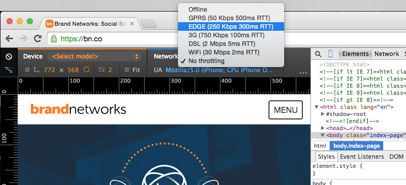

# [fit] an introduction to practical
# [fit] web performance

---

## [fit]mike schneider
## [fit]brand networks
## [fit]january, 2015

---

# who cares?

Walmart: 100ms improvement = up to 1% incremental revenue [^1]

[^1]: [WalmartLabs performance slide deck](http://www.slideshare.net/devonauerswald/walmart-pagespeedslide)

---

# who cares?

Firefox: -2.2s on download page → +15.4% downloads [^2]

[^2]: [Firefox & Page Load Speed – Part II](http://blog.mozilla.org/metrics/2010/04/05/firefox-page-load-speed-%E2%80%93-part-ii/)

---

# who cares?

- Google: 100-400ms results slowdown → 0.2%-0.6% fewer searches per user [^3]

[^3]: [Google Research Blog: Speed Matters](http://googleresearch.blogspot.com/2009/06/speed-matters.html)

---

# who cares?
- Users are getting more impatient, webpages are getting bigger, and more users are going mobile
- Google search prioritizes faster websites
- Page speed of our apps is an indicator to clients of our proficiency as engineers

---

# 3 pillars of fast websites

1. low page size
2. few HTTP requests
3. optimized for rendering by the browser

---

#[fit] 10 ways to make your
#[fit] stupid website feel really fast
##[fit] *(and you don't even have to care about algorithmic complexity)*

---

### (by the way, if you're not using Gulp or Grunt you should start)

---

#[fit] Minify your CSS, JS, HTML

##[fit] `cssmin`, `uglify.js`, `htmlmin`

### *(eliminate unnecessary whitespace, shorten variable names, etc)*

---

#[fit] Concatenate your CSS and JS
##[fit] `gulp-concat`, `grunt-contrib-concat`

---

#[fit] Load your CSS in the `<head>`
#[fit] and your JS right before `</body>`

---

#[fit] Inline above-the-fold CSS

##[fit] *`Critical` by Addy Osmani*
##[fit] *`criticalCSS` by Filament Group*

### **(this one is kinda hard)**

---

#[fit] Compress your images

##[fit] `gulp-image` and `grunt-image`
##[fit] losslessly compress all image types

###[fit] *sometimes these mangle SVGs, so be careful*

---

#[fit] Use a CDN for static content

## Amazon S3 + Cloudfront

---

#[fit] Leverage browser caching
## `Cache-Control`  http header

- index.html
    `Cache-Control: no-cache`
- style.3da37df.css:
    `Cache-Control: max-age=31536000`
    (1 year in seconds)

---

#[fit] Leverage browser caching

```javascript
// gulpfile.js for a static website
var gulp = require('gulp');
var cachebust = new require('gulp-cachebust')();
var sass = require('gulp-sass');
var ejs = require('gulp-ejs');

gulp.task('css', function() {
  return gulp.src('style/*.scss')
    .pipe(sass())
    .pipe(cachebust.resources())
    .pipe(gulp.dest('style/'));
});

gulp.task('html', ['css'], function() {
  return gulp.src('*.ejs')
    .pipe(ejs())
    .pipe(cachebust.references())
    .pipe(gulp.dest('./'));
});
```

---

# FastClick.js

Touchscreen browsers artificially add a 300ms delay on click events due to a touch gesture. FastClick removes the delay and makes your page feel faster

### [github.com/ftlabs/fastclick](https://github.com/ftlabs/fastclick)
### `bower install --save fastclick`

---

# Prefer skeletons to spinners
Focus on progress feels faster


---

# Do animations the right way
- If possible, prefer CSS animations to JS animations
- Prefer cheap animation properties: [^4]
    + position: `transform: translate(10px, 20px);`
    + scale: `transform: scale(0.5);`
    + rotation: `rotate(90deg);`
    + opacity: `opacity: 0.5;`

[^4]: [Paul Irish: High Performance Animations](http://www.html5rocks.com/en/tutorials/speed/high-performance-animations/), [Demo: The wrong way](http://codepen.io/paulirish/pen/nkwKs), [Demo: The right way](http://codepen.io/paulirish/pen/LsxyF)

---

# How can I measure how fast my website is?

1. Google PageSpeed
2. webpagetest.org
3. Chrome Dev Tools network tab

---

# How can I measure how fast my website is?

Use Chrome Dev tools to throttle your network speed



---

# [fit] Keep informed: follow these people on Twitter
+ *@paul_irish*, Google Chrome developer advocate
+ *@lukew*, author of *Mobile First*
+ *@scottjehl*, author of *Responsible Responsive Design*
+ *@RWD*, run by the author of *Responsive Web Design*

---

# Thank you


